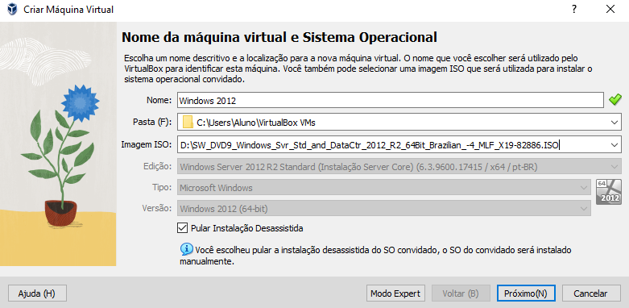

# windows-20122
Abrimos o aplicativo VisualBox, clicamos na aba novo do aplicativo VisualBox, colocamos o nome da maquina windows 2012,a pasta (F) deixamos do jeito que estava, imagem ISO colocamos imagem de istalação de sistema e deixa o resto como tá só aperta em proximo, no Hardware na memória base se coloca em 4096MB em processadores 4 CPU e clicar em próximo, o disco rígido virtual colocamos o tamanho do disco em 80GB e clicamos em proximo, súmario só clicamos em finalizar, chegamos na parte do windows server 2012 r2 vc so muda o teclado ou método de entrada para portuguÊs (Brasil ABNT2) e avancar, se vai mudar para windows server 2012 r2 standard (servidor com GUI) e clicar em avançar, clicar em aceito os termos de licença e depois avançar, clicar em personalizada instalar apenas o windows (avançado), clicar em novo e muda para 60GB a unidade 0 partição 2 e clicar em avançar, instalando o windows, o windows precisa ser reiniciado para continuar, nas configurações se vai colocar seus dados nome do usuário e senha e reinserir a senhae clicar em concluir, para entrar vai ter que clicar no teclado do computador Ctrl + delete, e coloque a senha que fez nas configurações e pronto.

